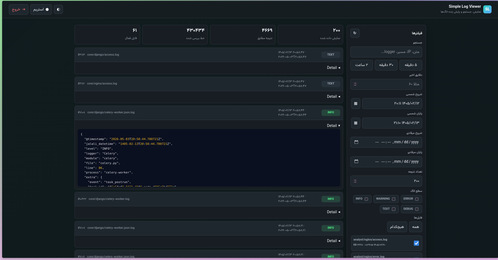

# Log Viewer

FastAPI log viewer for files under `data/` with Jalali and Gregorian date range filters, recent-minute filters, full-text search, colorful log levels, and 5-second live updates over Server-Sent Events.



## Features

- Secure login with username, password, and TOTP.
- TOTP secret, password, and session secret are read from environment variables.
- Reads nested log files from `data/` without exposing filesystem paths.
- Supports JSON line logs and common nginx access/error logs.
- Jalali date picker with time, plus Gregorian `datetime-local` range filters.
- Pretty syntax-colored JSON details when a log line can be parsed as JSON.
- Recent minutes shortcut, full-text search, level filters, file filters, and result limits.
- Responsive RTL UI with Vazirmatn FD NL loaded from ArvanCloud.
- Default logo and favicon from `static/`, with optional URL overrides from environment variables.
- Secure headers, HttpOnly same-site session cookie, signed session token, and path traversal protection.

## Setup

```bash
python3 -m venv .venv
source .venv/bin/activate
pip install -r requirements.txt
cp .env.sample .env
```

Edit `.env` and set strong values:

```env
LOG_VIEWER_USERNAME=admin
LOG_VIEWER_PASSWORD=use-a-strong-password
LOG_VIEWER_TOTP_SECRET=BASE32_TOTP_SECRET
LOG_VIEWER_SESSION_SECRET=use-a-long-random-secret
```

`LOG_VIEWER_TOTP_SECRET` must be a Base32 secret compatible with authenticator apps.

For slow development proxies, increase `LOG_VIEWER_CLIENT_API_TIMEOUT_SECONDS` and `LOG_VIEWER_SERVER_KEEP_ALIVE_SECONDS`.

For production behind HTTPS, also set:

```env
LOG_VIEWER_COOKIE_SECURE=YES
DEBUG=NO
```

## Run

```bash
uvicorn main:app --host 0.0.0.0 --port 8989
```

Then open:

```text
http://localhost:8989
```


## Docker

Build and run on port 80:

```bash
docker build -t simple-log-viewer .
docker run --env-file .env -p 80:80 -v $(pwd)/data:/app/data simple-log-viewer
```

Then open:

```text
http://localhost
```

## Tests

```bash
python3 -m unittest test_app.py
```

## Env Description

| Variable | Default | Description |
| --- | --- | --- |
| `DEBUG` | `NO` | Enables FastAPI debug mode and uvicorn reload when set to `YES`. |
| `PORT` | `8989` locally, `80` in Docker | HTTP port used by `python main.py` and the Docker command. |
| `BASE_URL` | `http://localhost:8989` | Base URL used for CORS defaults. |
| `CORS_ALLOWEDS` | Derived from `BASE_URL` | Comma-separated allowed CORS origins. Leave empty to allow `BASE_URL`, localhost, and 127.0.0.1 variants. |
| `LOG_DATA_DIR` | `data` | Directory that contains log files. |
| `LOG_VIEWER_USERNAME` | `admin` | Login username. |
| `LOG_VIEWER_PASSWORD` | `1234` | Login password. Set a strong value before deployment. |
| `LOG_VIEWER_TOTP_SECRET` | `JBSWY3DPEHPK3PXP` | Base32 TOTP secret compatible with authenticator apps. Set a private value before deployment. |
| `LOG_VIEWER_SESSION_SECRET` | Built-in development secret | HMAC session signing secret. Set a long random value before deployment. |
| `LOG_VIEWER_SESSION_COOKIE` | `slv_session` | Name of the browser session cookie. |
| `LOG_VIEWER_COOKIE_SECURE` | `NO` | Set to `YES` when serving over HTTPS so the session cookie is marked secure. |
| `LOG_VIEWER_SESSION_TTL_SECONDS` | `28800` | Session lifetime. |
| `LOG_VIEWER_LOGO_URL` | `/static/logo.png` | Logo URL shown in the header. |
| `LOG_VIEWER_FAVICON_URL` | `/static/favicon.ico` | Favicon URL used by the page. |
| `LOG_VIEWER_CLIENT_API_TIMEOUT_SECONDS` | `180` | Browser fetch timeout for API requests. Increase in slow development environments. |
| `LOG_VIEWER_SERVER_KEEP_ALIVE_SECONDS` | `120` | Uvicorn keep-alive timeout used by `python main.py` and Docker. |
| `LOG_VIEWER_STREAM_INTERVAL_SECONDS` | `5` | Delay between server-sent event refresh cycles. |
| `LOG_VIEWER_MAX_RESULTS` | `500` | Maximum returned results per query. |
| `LOG_VIEWER_MAX_SCAN_LINES` | `12000` | Recent lines scanned per file. |
| `LOG_VIEWER_MAX_LINE_LENGTH` | `20000` | Maximum number of characters read from each log line. Longer lines are truncated. |
| `LOG_VIEWER_CONTEXT_LINES` | `30` | Lines shown before and after a selected log in the context modal. |

## API

- `POST /api/login`
- `POST /api/logout`
- `GET /api/me`
- `GET /api/files`
- `POST /api/logs`
- `GET /api/log-context`
- `GET /api/stream`

All log APIs require the authenticated session cookie.
